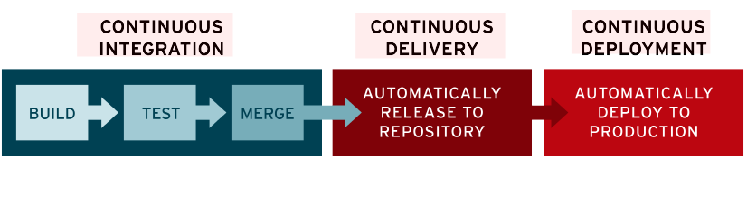

# intro

## CI/CD是什么

[what-is-ci-cd](https://www.redhat.com/zh/topics/devops/what-is-ci-cd)

持续集成的工作原理是将小的代码块推送到Git仓库中托管的应用程序代码库中，并且每次推送时，都要运行一系列脚本来构建、测试和验证代码更改，然后再将其合并到主分支中。

持续交付和部署相当于更进一步的CI，可以在每次推送到仓库默认分支的同时将应用程序部署到生产环境

### CI/CD 区别

"CI" 始终指持续集成，它属于开发人员的自动化流程。成功的 CI 意味着应用代码的新更改会定期构建、测试并合并到共享存储库中。该解决方案可以解决在一次开发中有太多应用分支，从而导致相互冲突的问题

"CD" 指的是持续交付和/或持续部署，这两个概念有时会交叉使用。两者都事关管道后续阶段的自动化，但它们有时也会单独使用，用于说明自动化程度
- **持续交付** 通常是指开发人员对应用的更改会自动进行错误测试并上传到存储库（如 GitHub 或容器镜像仓库），然后由运维团队将其部署到实时生产环境中。这旨在解决开发和运维团队之间可见性及沟通较差的问题。因此，持续交付的目的就是确保尽可能减少部署新代码时所需的工作量
- **持续部署** (另一种"CD")指的是自动将开发人员的更改从存储库发布到生产环境，以供客户使用。它主要为了解决因手动流程降低应用交付速度，从而使运维团队超负荷的问题。持续部署以持续交付的优势为根基，实现了管道后续阶段的自动化

## CI/CD项目

drone
- CI
- 26k
- [drone](https://github.com/harness/drone)

argo-cd
- CD
- 11.2k
- [argo-cd](https://github.com/argoproj/argo-cd/)

gitlab
- CI/CD
- 23.1k
- [gitlabhq](https://github.com/gitlabhq/gitlabhq)
